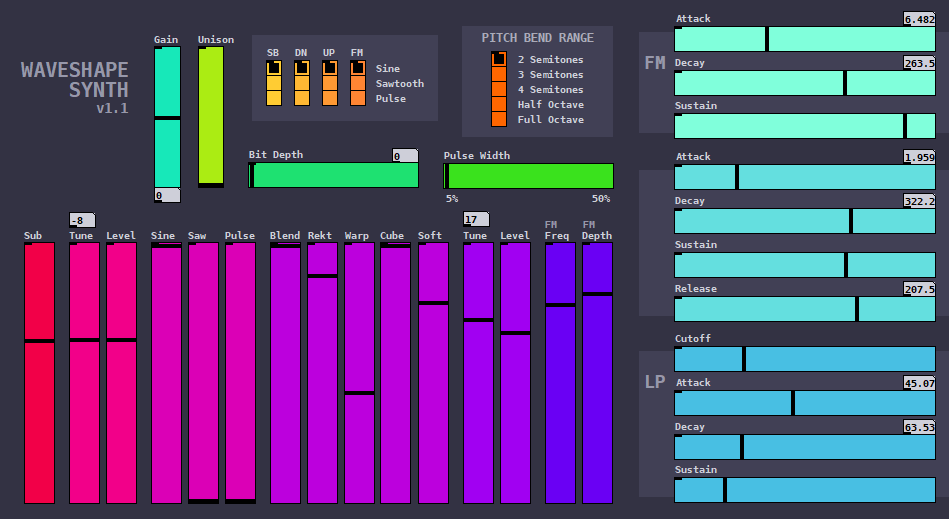

# Dahlia - Waveshaping Synthesis for HVCC

**Dahlia** is an implementation of the [Waveshape-Synth](https://github.com/vulcu/waveshape-synth) polyphonic synthesizer written in PureData and intended for use with the [Heavy Compiler Collection](https://github.com/Wasted-Audio/hvcc). Possible applications include the [Daisy Audio Platform](https://www.electro-smith.com/daisy) (using [pd2dsy](https://github.com/electro-smith/pd2dsy)), the [Distrho Plugin Framework](https://github.com/DISTRHO/DPF), and Javascript (using WebAssembly).

## Table of Contents

* [General Info](#general-info)
* [Features](#features)
* [Installation (Daisy)](#installation-daisy)
* [Installation (DPF)](#installation-dpf)
* [Algorithms](#algorithms)
* [References](#references)

## General Info

The original [Waveshape-Synth](https://github.com/vulcu/waveshape-synth) is an 8-voice polyphonic audio synthesizer with per-voice oscillator waveshaping created as a collection of Pure Data subpatches. It was inspired by [wavedist](https://github.com/vulcu/wavedist) and uses the same waveshaping algorithms. **Dahlia** is an evolution of this concept, refactored to work with HVCC and capable of a simplified control scheme accomodating the limited Daisy Pod UI. **Dahlia** can also be used directly from within Pure Data, see `main_puredata.pd` for an example.

The synthesizer itself relies on a handful of waveshaping algorithms to produce differing kinds of overdrive and distortion from the oscillators of each synthesizer voice, and then applies an ADS-envelope low-pass filter to each voice on an individual basis. The harmonic ratios and the balance between even and odd harmonics varies by algorithm, with some sounding better than others for certain oscillator and envelope combinations. There's no hard-and-fast rules here, so just use your ears.

The goal of this project is to provide a quick and simple way for a user to dial in rich, complex synth sounds without needing to know much about synthesizers. Unlike the [wavedist](https://github.com/vulcu/wavedist) plugin, all the waveshapers are active at once here, allowing for some truly wild harmonic ratios.

## Features

* Monophonic (1 Voice) and Polyphonic (8-voices)
  * Polyphonic version easily adaptable to _N_ number of voices depending desired performance
  * Portamento control (monophonic only)
* 7 Oscillators, 1 ADSR, and 2 ADS envelopes per-voice
* Oscillators selectable between Sine, Saw, and a PWM with a 5%-50% automatable duty-cycle
* 6 different waveshaping algorithms and a Gain control
* Unison control (oscillator de-tune)
* Bit depth control/crush range of 1-12 bits

## Installation (Daisy)

1. Follow the instructions for [installing the Daisy Toolchain for your OS](https://github.com/electro-smith/DaisyWiki/wiki/1.-Setting-Up-Your-Development-Environment#1-install-the-toolchain)
1. Install python for your OS (requires Python >=3.7)
    1. On MacOS and Linux Python 3.x may already be installed, this can be checked in the terminal using `python3 --version`. If it's not installed, installation is easy but the specifics will depend on your package manager (i.e. `brew`, `apt`, `pacman`, etc.)
    1. Details for [installing python on windows](https://github.com/electro-smith/DaisyWiki/wiki/1c.-Installing-the-Toolchain-on-Windows#python-optional). Ensure the installed version is at least 3.7.
1. Clone this repo with `git clone https://github.com/vulcu/dahlia.git`, and navigate to the cloned repository.
1. Once navigated to the repository, run the following to create a new Python virtual environment (commands here are specific to **git-bash** in Windows and may vary slightly for other OS, i.e. `python3` instead of `py`):

```bash
$ py -m ensurepip -U
$ py -m pip install virtualenv

# if there's an existing .venv directory be sure to delete it first!
$ py -m venv ./.venv
```

5. Once the python virtual environment is installed to `dahlia/.venv`, activate it and install this fork of the [Heavy Compiler Collection (hvcc)](https://github.com/Wasted-Audio/hvcc) along with [the pd2dsy dependencies](https://github.com/electro-smith/pd2dsy).

```bash
$ source ./.venv/Scripts/activate   # for MacOS/Linux this is `./.venv/bin/activate`
$ pip install -r requirements.txt
$ deactivate
```

6. Run the following to initialize all Git submodules, then Build `libdaisy` using the [Daisy toolchain](https://github.com/electro-smith/DaisyWiki/wiki/1.-Setting-Up-Your-Development-Environment#1-install-the-toolchain):

```bash
$ git submodule update --init --recursive
$ cd lib/pd2dsy/libdaisy
$ make clean | grep "warning:\|error:"
$ make -j4 | grep "warning:\|error:"
```

7. Install a second Python virtual environment specifically for `pd2dsy`:

```bash
$ py -m venv ./pd_env
$ source ./pd_env/scripts/activate  # for MacOS/Linux this is `./pd_env/bin/activate`
$ pip install -r requirements.txt
$ pip install setuptools
$ deactivate
$ cd ../../..
```

8. If there's no errors from the above, then everything **Dahlia** needs is ready to go. As a test, the code can be compiled using hvcc:

```bash
# build for a target (e.g. Daisy) from pd source using HVCC only
$ source ./dahlia-hvcc.sh daisy

# build from pd source and compile for Daisy platform using Arm toolchain
$ source ./dahlia-daisy-pd2dsy.sh
```

The second script will automatically try uploading to a Daisy device. The UI is expected to work, but audio will not as the Pd code uses the `|null_voice|` module in place of `|monophonic|`. The reason for this is a known memory limitation; Electrosmith [has not released a working `pd2dsy` solution](https://github.com/electro-smith/pd2dsy/issues/24) for executables larger than 128 kB.

### Daisy Pod I/O (Configured)

| Name | Function | Type | Variants |
| --- | --- | --- | --- |
| `sw1` | _Select `knob1` function_ | Switch | `sw1_press`, `sw1_fall`, `sw1_seconds` |
| `sw2` | _Select `knob2` function_ | Switch | `sw2_press`, `sw2_fall`, `sw2_seconds` |
| `knob1` | _Parameter Control_ | Voltage Input | --- |
| `knob2` | _Parameter Control_ | Voltage Input | --- |
| `encoder` | _Preset Selection (0-15)<br>Reset Preset (Press)_ | Encoder | `encoder_press`, `encoder_rise`, `encoder_fall`, `encoder_seconds` |
| `led1` | _`knob1` function selection_ | RGB LED | `led1_red`, `led1_green`, `led1_blue`, `led1_white` |
| `led2` | _`knob2` function selection_ | RGB LED | `led2_red`, `led2_green`, `led2_blue`, `led2_white` |
| `gatein` | _unassigned_ | Gate In | `gatein_trig` |
| --- | Volume | Potentiometer | --- |

## Installation (DPF)

1. On Windows, follow the instructions for [installing MSYS2 on Windows](https://www.msys2.org/). If using VSCode, [this article on getting started with C++ and MinGW](https://code.visualstudio.com/docs/cpp/config-mingw) is also a good starting point. On Linux (Ubuntu), you will need to make sure you have the `build-essentials` and `pkg-config` packages installed. Other Linux distributions may require different packages, but need to be configured to enable building C++ for x86 platforms.
    1. Documentation for DPF is available here: [https://distrho.github.io/DPF/](https://distrho.github.io/DPF/). See the [DPF Github Page](https://github.com/DISTRHO/DPF) for more information.
1. Clone this repo with `git clone https://github.com/vulcu/dahlia.git`, and navigate to the cloned repository.
1. Once navigated to the repository, run the following to create a new Python virtual environment (commands here are specific to **git-bash** in Windows and may vary slightly for other OS, i.e. `python3` instead of `py`):

```bash
$ py -m ensurepip -U
$ py -m pip install virtualenv

# if there's an existing .venv directory be sure to delete it first!
$ py -m venv ./.venv
```

4. Once the python virtual environment is installed to `dahlia/.venv`, activate it and install this fork of the [Heavy Compiler Collection (hvcc)](https://github.com/Wasted-Audio/hvcc).

```bash
$ source ./.venv/Scripts/activate   # for MacOS/Linux this is `./.venv/bin/activate`
$ pip install -r requirements.txt
$ deactivate
```

5. Run the following to initialize all Git submodules:

```bash
$ git submodule update --init --recursive
```

6. If there's no errors from any of the above steps, then everything **Dahlia** needs is ready to go. As a test, the code can be compiled using hvcc:

```bash
# build for a target (e.g. Daisy) from pd source using HVCC only
$ source ./dahlia-hvcc.sh daisy
```

Followed by compilation of the hvcc output using `make`. On Windows, this may require changing to a different shell environment, e.g. UCRT64/MSYS2, depending on how the C++ build tools from **1.** above are installed/configured.

## To Do

* ~~Pre-development planning~~
* **General**
  * ~~Refactor PD source for HVCC compatibility~~
* **Daisy**
  * ~~Refactor `main_daisy.pd` to target Daisy build~~
  * ~~Redesign UI for Daisy Pod~~
    * ~~Daisy Pod UI simulator~~
  * ~~Build scripts targeting Daisy (HVCC and pd2dsy)~~
* **Distrho Plugin Framework**
  * ~~Refactor `main_dpf.pd` to target DPF build~~
  * ~~Build script targeting DPF (HVCC)~~
* **Javascript**
  * Refactor `main_js.pd` to target Javascript/WebAudio build
  * Build script targeting Javascript/WebAudio (HVCC)

**Status: This project is in active development**

## Algorithms

This project uses the following algorithms for waveshaping and signal limiting:

```
 1) soft clip alg:        y[n] = (1.5*x[n]) - (0.5*x[n]^3);
 2) leaky integrator alg: y[n] = ((1 - A) * x[n]) + (A * y[n - 1]);
 3) soft knee clip alg:   y[n] = x[n] / (K * abs(x[n]) + 1);
 4) cubic soft clip alg:  y[n] = (1.5 * threshold * HardClip(x[n])) -
                                ((0.5 * HardClip(x[n])^3) / threshold);
 5) warp alg: y[n] = (((x[n] * 1.5) - (0.5 * x[n]^3)) * (((2 * K) / (1 - K))
                    + 1)) / ((abs((x[n] * 1.5) - (0.5 * x[n]^3)) 
                    * ((2 * K) / (1 - K))) + 1);
 6) rectify alg: y[n] = ((1 - R) * softclip(x[n])) + (|softclip(x[n])| * R);
```

## References:

1) Aarts, R.M., Larsen, E., and Schobben, D., 2002, 'Improving Perceived Bass and Reconstruction of High Frequencies for Band Limited Signals' Proc. 1st IEEE Benelux Workshop MPCA-2002, pp. 59-71
1) Arora et al., 2006, 'Low Complexity Virtual Bass Enhancement Algorithm for Portable Multimedia Device' AES 29th International Conferance, Seoul, Korea, 2006 September 2-4
1) Gerstle, B., 2009, 'Tunable Virtual Bass Enhancement', [ONLINE] <http:rabbit.eng.miami.edu/students/ddickey/pics/Gerstle_Final_Project.pdf>
1) Yates, R. and Lyons, R., 2008, 'DC Blocker Algorithms' IEEE Signal Processing Magazine, March 2008, pp. 132-134

<br>
(C) 2021-2023, Winry R. Litwa-Vulcu
